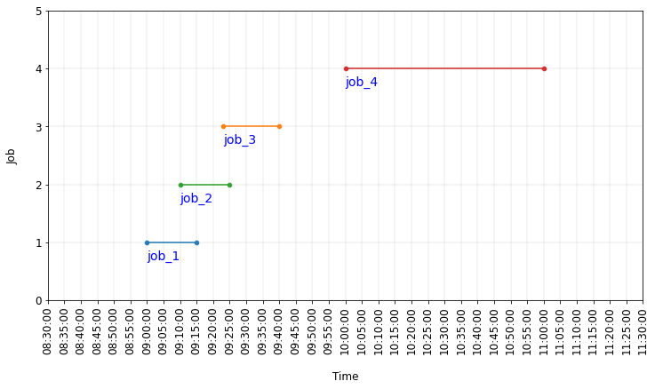

# Background  
* Data analytics and data science need good quality data.  
* Hence getting and cleaning the raw data is important.  
* There are many articles available on this topic.  
* Here, I will share on correcting one kind of inaccurate data.  

# Business Context  
* A service personnel has to do assigned jobs from 9 am to 12 pm (roster duration).  
* For each job, he has to record its start time and end time (service duration).  
* This data will enable his utilisation rate (service duration divided by roster duration) to be calculated  

# Problem  
* The service personnel did not record the start time and stop time of some jobs accurately.  
* As a result, the start time and end time of some jobs overlap each other.  
* Consequently, his utilisation rate will be inflated.  
 
# Solution  
* If the start time of next job is between the start time and end time of current job, change the end time of current job to start time of next job.  
* Before correction:  
  * Job 1 overlaps Job 2  
  * Job 2 overlaps Job 3  
  
  

* After correction:  
  * No overlap of all jobs  
  * Utilisation rate will be more accurate  
  
  

# Final Words  
* Do refer to the Python codes on how to correct this kind of inaccurate data.  
  * F5 and F6 contain F1 to F4  
* Do let me know your thoughts and suggestions on this article  

# Search Keywords  
datetime overlap, datetime in string, datetime in datetime, find substring, plot datetime seaborn scatter chart, correct datetime overlap  
