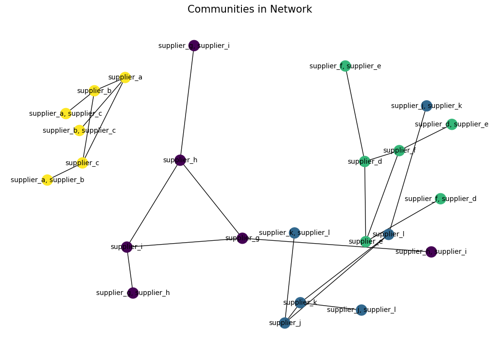
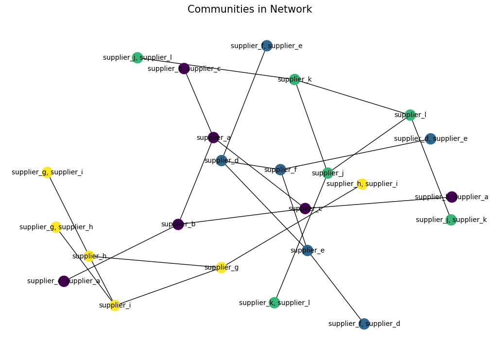

# **Identify Irregularities in Procurement (Association Rule Mining and Network Analysis)**
 

## <u>**Context**</u>
 

In procurement, external goods and services are acquired for the internal departments of the company to use to run the departments and company.
 
 

Hence, the procurement process will involve:
* Specifying
* Sourcing
* Evaluating
* Setting up of contracts to purchase
* Purchasing
 
 

The expected output of the procurement process is that the cost, quality, availability, delivery, and financial transactions of goods and services are in accordance with the contract. At the same time, suppliers, vendors, and contractors must be fairly treated.
 
 

However, irregularities in the procurement process do occur, be it intentional or unintentional. Due to these irregularities, the actual output will be different from the expected output. To identify them for investigation, correction, and prevention, random audit is done. But, to have a higher probability of identifying them compared to random audit, data analytics and data science methods can be used.
 
 

This piece of work will demonstrate how data analytics and data science methods can be used to identify favouritism (one of the irregularities) in the procurement process.
 
 

References:

* https://www.procuredesk.com/procurement-fraud/
* https://iacrc.org/fraud-and-corruption/the-most-common-procurement-fraud-schemes-and-their-primary-red-flags/
 
 

## <u>**Working Steps**</u>
 

Step 1: Establish the objective.

To identify favouritism in the procurement process for investigation.
 
 

Step 2: Understand the process.

Specify >>> Source >>> Invitation to tender >>> Evaluate >>> Select >>> Set up contract to purchase >>> Purchase goods and services
 
 

Step 3: Envision the objective.

Imagine how favouritism in the procurement process will look like:
* Case 1: Requestor keeps giving business to 1 or 2 suppliers in the system with a higher amount
* Case 2: Requestor keeps giving business to 1 or 2 suppliers not in the system with a higher amount
 

Step 4: Envision the methods to achieve the objective.

* Look for high co-occurrence between suppliers
* Look for high connection between requestor and suppliers

Hence (a) Association Rule Mining and (b) Network Analysis are the most appropriate methods.
 
 

Step 5: Identify the data needed and their sources from Step 3 and Step 4.

* Names of requestor
* Names of suppliers, vendors, contractors
* Award dates
* Award amount
 

## <u>**Set Up**</u>
 

Since there is no labelled data for training or trained model for classification, synthesized data will be used.

This is how a procurement process without favouritism will look like:

 
 

This is how a procurement process with favouritism will look like:

 
 

 
 

The Association Rule Mining method based on the Apriori Algorithm can be obtained from the Python package "MLxtend". Network Analysis method can be obtained from the Python package "NetworkX".
 
 

Python packages:

* MLxtend >>> https://rasbt.github.io/mlxtend/api_subpackages/mlxtend.frequent_patterns/
* NetworkX >>> https://networkx.org/documentation/stable/tutorial.html
 

## <u>**Results**</u>
 

You can refer to the Jupyter Notebooks analysis_irregularities*.ipynb for the codes and analyses.
* Filenames with \*no* >>> Has no irregularities
* Filenames with \*yes* >>> Has irregularities
* Filenames with \*a* >>> Association Rule Mining on suppliers
* Filenames with \*b* >>> Network Analysis on suppliers from Association Rule Mining
* Filenames with \*c* >>> Network Analysis on requestors and suppliers
 
 

In Case 1 of Step 3, the irregularities for supplier_a and supplier_b can be detected through the community plot as separate community (see yellow nodes). The irregularities can also be detected between requestor and supplier_a and supplier_b through the connection plot as thicker lines.

 
 

 
 

In Case 2 of Step 3, the irregularities for supplier_aaa and supplier_bbb can be detected through the community plot as separate community (see yellow nodes). The irregularities can be detected between requestor and supplier_aaa and supplier_bbb through the connection plot as thicker lines.

 
 

 
 

If there are no irregularities, the community and connection plots will look like these:

 
 

 
 

Similarly, the Association Rule Mining can also indicate presence of irregularities with the support of the antecedent-consequent pair as follows:

 
 

## <u>**Conclusion**</u>
 

It is important to:

* Establish the objective
* Understand the process
* Envision the objective
* Envision the methods to achieve the objective
* Identify the data needed and their sources from Step 3 and Step 4

If there is no labelled data for training or trained model for classification, I <u>**PROPOSE**</u> synthesizing data that represents the ideal situation, follow by combining them with existing data for modelling >>> **WHAT DO YOU THINK OF THIS?**
 
 

That's it, folks! Hope you find this work useful. Feel free to connect with me in LinkedIn. Have a good day!
 
 
 
 

20 Feb 2024
 
 

John Wong &nbsp;&nbsp; 
 
 

**[BACK TO MAIN PAGE ==>](https://github.com/johnwck/my_da_ds_work/tree/master)**
 
