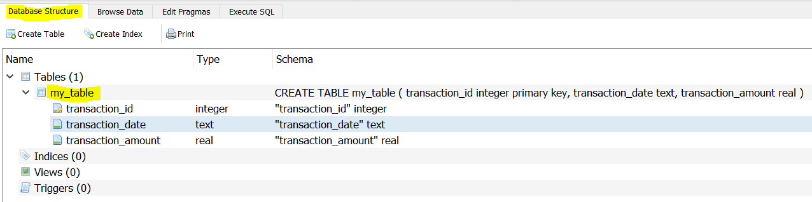
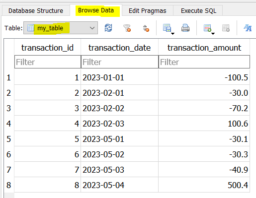

## **Data Operations (SQL)**
 

#### <u>**Background and Context**</u>
 

There are many resources on the extraction of data from the database or data warehouse using SQL. In this step-by-step exercise, I will demonstrate how data are loaded into the database or data warehouse for extraction.
 
 

#### <u>**Step 1**</u>
 

You will need to get a database engine. In this exercise, I will use SQLite. The user interface for SQLite is DB Browser . You can now open ***step_01.ipynb*** to go to the URL to download and install DB Browser for SQLite.
 
 

#### <u>**Step 2**</u>
 

Following that, a database will need to be created. You can now open ***step_02.ipynb*** to learn how to do so.
 
 

#### <u>**Step 3**</u>
 

Inside a database, there can be many tables. For example, you can have a table to store customer transactions and another table to store customer demographics.
 
 

In a table, there can be many fields in the form of columns for SQLite. For example, you can have customer identification, their purchase date and purchase amount as fields in the customer transactions table.
 
 

Hence after creating a database, you will need to create a table and its fields to load your data. You can now open ***step_03.ipynb*** to learn how to do the followings:
* Establish connection to the database
* Create a table and its fields in the database
* Insert data into the table and its fields
* Insert new data and update existing data
* Close connection to the database
 
 

 
 

 
 

#### <u>**Step 4**</u>
 

In this step, I made the exercise into a more realistic scenario like in production.
 
 

In production, your data to be loaded is usually in the form of a dataframe. If the datatype of the (a) columns of the dataframe and the (b) fields of the table do not match, data will not be loaded. For example, date can be of datatype date only, date with time, or string.
 
 

One also needs to know how to format the dataframe for the data to be loaded. Should the dataframe be in its original form, transformed into a dictionary, list of lists, or list of tuples?
 
 

Sometimes, an integer column of the dataframe may not match an integer field of the table. This issue was encountered and resolved in this step.
 
 

You can now open ***step_04.ipynb*** to learn how to navigate the above situations.
 
 

#### <u>**Final Note**</u>
 

Different database engines have different ways of handling data and its datatype. For example, date in SQLite must be TEXT while date in PostgreSQL can be TIMESTAMP.
 
 

In SQLite, updating data in the database can be done using 'REPLACE' without parameters. However, in PostgreSQL, it is done using 'ON CONFLICT' with parameters to be specified.
 
 

Updating data in the database can only be done with a PRIMARY KEY specified. This concept was introduced in ***step_03.ipynb*** and ***step_04.ipynb***.
 
 
 
 

Hope you find this work useful. Feel free to connect with me in LinkedIn. Have a good day!
 
 

14 Nov 2023
 
 

John Wong &nbsp;&nbsp; 
 
 

**[BACK TO MAIN PAGE ==>](https://github.com/johnwck/my_da_ds_work/tree/master)**
 
