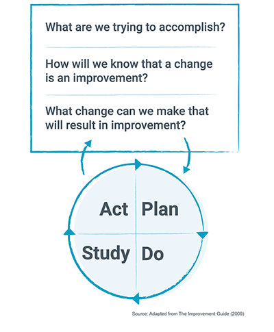
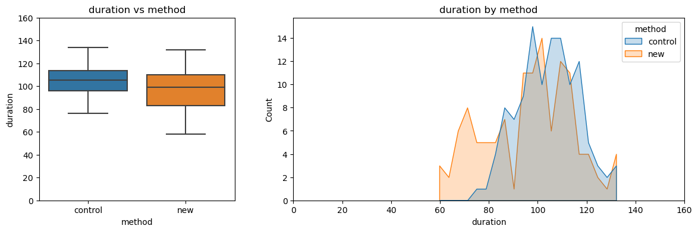
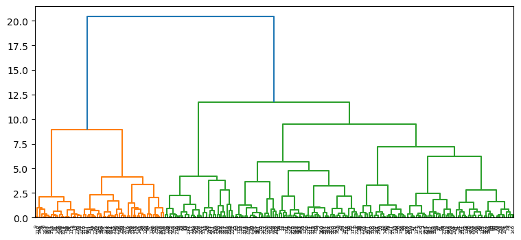
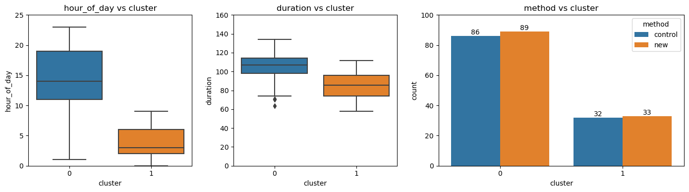
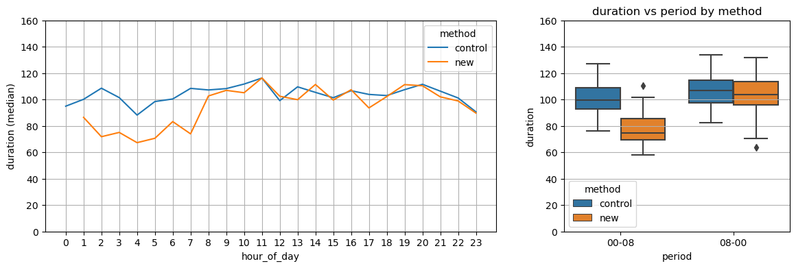

# **Data Science in Quality Improvement (Hierarchical Clustering)**
 

## <u>**Quality**</u>
 

Being a consultant and trainer in quality improvement, I will summarise the concepts of quality from first principles as follows:
* Quality is a comparison between the actual and expected performances.
* Poor quality is when the actual performance is worse than the expected.
* Quality improvement is to change the actual so that its performance is better than the expected.
 
 

## <u>**Quality Improvement**</u>
 

The Model for Improvement can be used as a guide for quality improvement work.

 
 

* It was developed by Associates in Process Improvement
* It is used by Institute for Healthcare Improvement as the framework
 
 

More information can be found here >>> https://www.ihi.org/resources/how-to-improve and https://www.apiweb.org/
 
 

## <u>**Data Science in Quality Improvement**</u>
 

The focus is on the 3rd Question: "What change can we make that will result in improvement?" and the "Plan, Do, Study, Act Cycle" (aka PDSA Cycle).
* To improve, we must make changes.
* However, changes we made may not result in improvement.
* Hence the PDSA Cycle is used to check the result of changes made.
 
 

In this exercise, I will show you how Hierarchical Clustering was used to give quick clues to "why" a new method did not reduce the duration of a task.
 
 

## <u>**Phase 1**</u>
 

The team developed a new method to reduce the duration of a task.
 
 

Using the PDSA Cycle, the team found that the new method did not significantly reduce the duration.

 
 

Faced with this situation, the team has two choices:
* Choice 1: Find out "why" the new method did not work (learn from failures)
* Choice 2: Design another new method to pilot
 
 

The team decided to take Choice 1. But finding the "why" could be difficult. For example, what should the interview questions be. Who should they interview. Hence I suggested mining the data for more insights using Hierarchical Clustering.
 
 

## <u>**Phase 2**</u>
 

The inputs to Hierarchical Clustering were  
(a) hour of day  
(b) method  
(c) duration  
 
 

Since method is categorical, it has to be encoded into the numeric '0' and '1'.  
(a) '0' is the control method  
(b) '1' is the new method  
 
 

In most situations, the target (duration) is not being used in clustering models. However, I opted to use it because the hour of day and method will naturally be divided into 4 clusters with no other useful information.
 
 

The hour of day and duration were scaled using the standard-normal method so that they have equal contributions to the distance computation.
 
 

For the linkage method, I have used "Ward".  
For the measure of distance, I have used "Euclidean".  
More information can be found here >>> https://www.mygreatlearning.com/blog/hierarchical-clustering/
 
 

With the dendrogram produced as shown below, I have cut off at 2 clusters.

 
 

More information can be found here >>> https://www.displayr.com/what-is-dendrogram/
 
 

## <u>**Phase 3**</u>
 

The clusters formed were added back to the data. The objective is to study the characteristics of both clusters in terms of their hour of day, method, and duration.
 
 

As shown in the charts below, Cluster 1 has earlier hours and shorter duration compared to Cluster 0. Both clusters have comparable count of new and control methods.

 
 

This gave me the clue to plot duration throughout the hour of day and, at the same time, differentiating the new and control methods
 
 

## <u>**Phase 4**</u>
 

 
 

From the line chart, the new method did have a significant reduction in duration in the early hours. However, in the later hours, the duration increases again.
 
 

This could mean that the new method may be done differently between the night shift and day shift staff.
 
 

This insight quickly gave the team clues on how to design the interview questions and who should they interview to find out "why" the new method did or did not work. This will reduce their time spent on learning from failures.
 
 

## <u>**Final Note**</u>
 

You can now refer to ***hierarchical_clustering.ipynb*** for the codes and steps to do hierarchical clustering.
 
 

That is, folks! Hope now you can see that data science methods can be applied in quality improvement work.
 
 
 
 

Hope you find this work useful. Feel free to connect with me in LinkedIn. Have a good day!
 
 

16 Nov 2023
 
 

John Wong &nbsp;&nbsp; 
 
 

**[BACK TO MAIN PAGE ==>](https://github.com/johnwck/my_da_ds_work/tree/master)**
 
