# **Identify Topics in Documents and Classify Documents to Topics Identified**
 

## <u>**Context**</u>

If you work in customer service or marketing, you will need to get feedback from your customers to learn about their expectations, experience, comments, and suggestions on your products and services. The topics in the feedback will enable you to know what to work on, and which one to work on first, with the different functions in the company to improve the quality of your product and services.
 
 

## <u>**Question**</u>

On some occasions, you will receive lots of feedback. However, you may not have the time to read through all of them. In this situation, you may not have an accurate picture on the topics. What can you do to read through as many of the feedback as possible in the shortest possible time?
 
 

## <u>**Answer**</u>

You can apply Latent Semantic Indexing on all the feedback.
 
 

## <u>**Latent Semantic Indexing (LSI)**</u>

It is an unsupervised machine learning method to identify the topics in the feedback based on the co-occurrences of words in them. Unsupervised because you do not need to read through the feedback and put a topic (label) as the target to train a model.
 
 

## <u>**Topic**</u>

For example, if words like "data" and "science" appear together frequently (high co-occurrence), the topic is on "data science". If words like "data", "science", "complicated", "statistics", and "mathematics" appear together frequently, the topic is most likely on "the difficulty of learning data science".
 
 

## <u>**Words, Numbers, and Embedding**</u>

Machine learning models can only accept numbers, not words, as input. Hence words have to be converted to vectors of numbers.
* One of the dimension of the vector is the ID of a word. Every word has its own ID.
* Another dimension of the vector is the count of the occurrences of the word.
* Together, they form a vector of numbers (ID, count of occurrences).

The conversion from words to vectors of numbers is known as embedding.

In the Transformer model by Google and Generative Pre-Trained Transformer (GPT) model by OpenAI, input embedding are also done.
 
 

GPT model &nbsp;&nbsp;&nbsp; 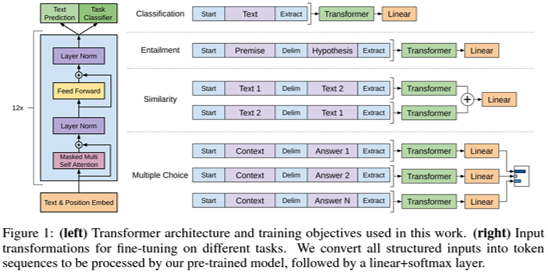

Source:
https://cdn.openai.com/research-covers/language-unsupervised/language_understanding_paper.pdf
 
 

Transformer model &nbsp;&nbsp;&nbsp; 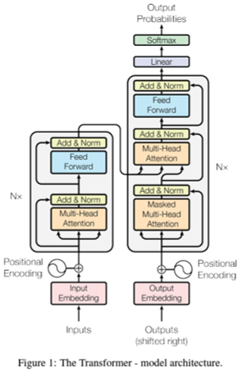

Source:
https://papers.neurips.cc/paper/7181-attention-is-all-you-need.pdf
 
 

## <u>**Data Science Workflow**</u>

#### <u>**Step 1: Documents**</u>

You can now open ***step_01_exercise_bow.ipynb*** to follow along. This Jupyter Notebook contains the basics to build the foundation.

I have synthesized data in a Comma-Separated Values (CSV) file.
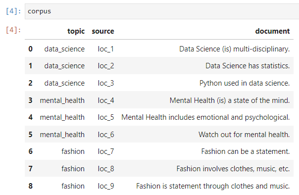
 

In data cleaning, I have removed non-alphanumeric characters and changed all characters to lower case.
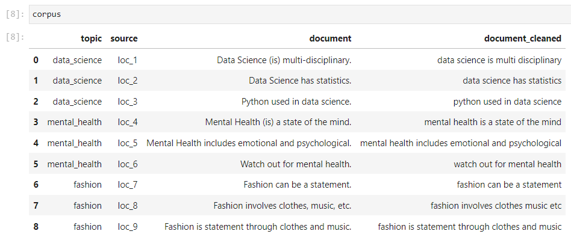
 

#### <u>**Step 2: Tokens**</u>

As mentioned above, words have to be converted to vectors of numbers as input to machine learning models.

In this step, I will work on the "ID" dimension of the vector.

A document can be a conversation, feedback, review, book, or article. A token can be an individual word or contiguous words in a document. Now, we will change the terminology from ID of a word to ID of a token. In this work, I have used individual words as tokens.

From documents of individual words, I have converted them into lists of tokens. However, I have excluded stopwords from the lists of tokens. Note that the tokens are still words, not numbers, yet.
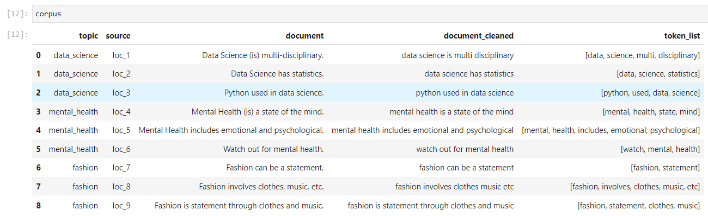
 

#### <u>**Step 3: Bag of Words Vector**</u>

In this step, I will work on the "count of occurrences" dimension of the vector.

If a token appears only once in all the documents, I will remove it from the training of the model.
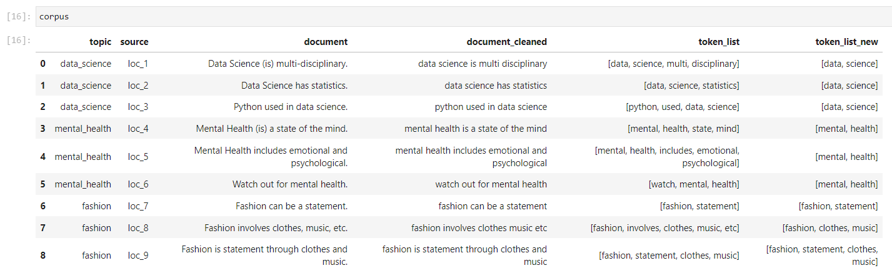
 

The "dictionary" method will be used to track the ID of the remaining tokens.
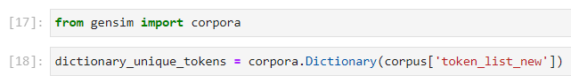

The "doc2bow" method will be used to convert the remaining tokens to the Bag of Words (BOW) vectors.

The BOW vectors will now contain the token ID and count of its occurrences.
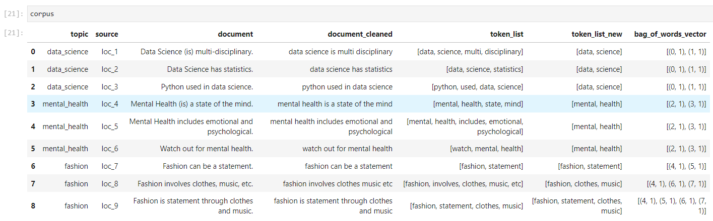

At this stage, input embedding is completed.
 

#### <u>**Step 4: Latent Semantic Indexing**</u>

I have used the following code to extract the different number of topics.
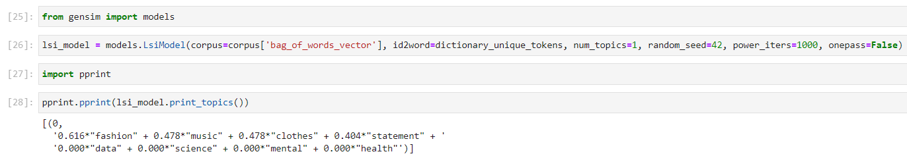
* num_topics = Set the number of topics to extract.
* random_seed = Set a number to have repeatable and reproducible results.
* power_iters = Set a higher number to get higher accuracy.
 
 

I have used the following code to determine the coherence score on the different number of topics extracted.
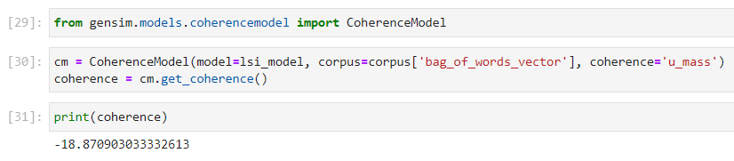
* coherence = "u_mass" is used. It will changed with the number of topics extracted.
 
 

You can now open ***step_02_real_bow.ipynb*** to follow along. This Jupyter Notebook contains real data running through the same steps as above. You will notice a significant difference in the coherence score with three topics extracted.

#### <u>**Step 5: Current Documents (Identify Topics)**</u>

You may wonder how to determine the optimal number of topics to be extracted.

You can now open ***step_03_real_bow_topic_identification.ipynb*** to follow along. This Jupyter Notebook contains the method to determine the optimal number of topics to be extracted.

Essentially, I plotted the coherence score versus the number of topics extracted. The number of topics corresponding to the highest coherence score should be the optimal number of topics to be extracted. I have also printed out the topics to check them qualitatively.
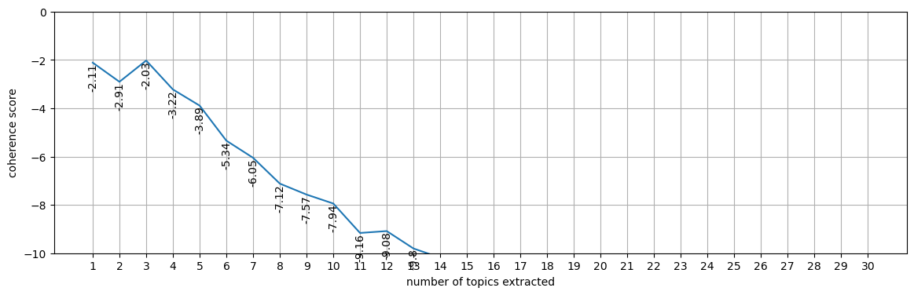

Getting the optimal number of topics to be extracted is equivalent to training the model to classify feedback.
 

#### <u>**Step 6: Future Documents (Classify to Topics Identified)**</u>

Now that the model is trained, it will be used to classify future feedback to the topics identified.

You can now open ***step_04_real_bow_topic_classification.ipynb*** to follow along. This Jupyter Notebook contains the method to train the model with three topics to classify feedback to be received in the future.
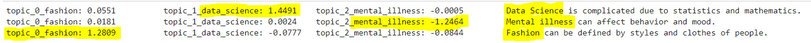
 
 
 

That is, folks! There are many things I may not be able to explain better than the developers. For that, I will have to refer you to the followings:
 

Core concepts:  
https://radimrehurek.com/gensim/auto_examples/core/run_core_concepts.html#sphx-glr-auto-examples-core-run-core-concepts-py
 

Corpora and Vector Spaces:  
https://radimrehurek.com/gensim/auto_examples/core/run_corpora_and_vector_spaces.html
 

Topics and Transformations:  
https://radimrehurek.com/gensim/auto_examples/core/run_topics_and_transformations.html
 

API Reference:  
https://radimrehurek.com/gensim/apiref.html

Topic Analysis: The Ultimate Guide:  
https://monkeylearn.com/topic-analysis/
 
 
 
 
Hope you find this work useful. Feel free to connect with me in LinkedIn. Have a good day!

10 Dec 2023

John Wong &nbsp;&nbsp; 
