# **Convolutional Neural Network using PyTorch - Part 1 of 2**
 

## <u>**Context**</u>
 

When you learn about Convolutional Neural Network (CNN), you will encounter methods like Convolution, Rectified Linear Unit Function, Max Pooling, Flattening, and Fully Connected Layer. Inside the Fully Connected Layer, there are Linear Transformation and Sigmoid Function.
 
 

When CNN is used on images, you will encounter terms like colour and grayscale, their channels, sizes, and tensor forms.
 
 

Finally, you will encounter pickle file that store the images and their labels.
 
 

In Part 1, I will provide the codes and their outputs on the above to give you a high-level view of the connecting steps in a CNN. This will build a foundation for you to do a CNN in Part 2. For their detailed explanations, you can visit the references below to read more about them.
 
 

## <u>**Image: Colour, Grayscale, Size, Channel, and Tensor Form**</u>
 

You may open ***step_01*** jupyter notebook to follow along.
 
 

In Step 2, you can use "Image.open" and "Image.resize" methods from "PIL" library to open and resize a JPG image.

Colour image of size (300,300) >>> 
 
 

In Step 3, you can transform a colour image to grayscale using "transforms.Grayscale" method from "torchvision" library.

Grayscale image of size (300,300) >>> 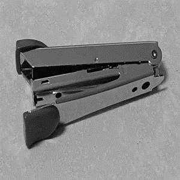
 
 

When a colour image is transformed to its tensor form in Step 4a using "transforms.ToTensor" method from "torchvision" library, it will have 3 channels representing Red, Green, and Blue.

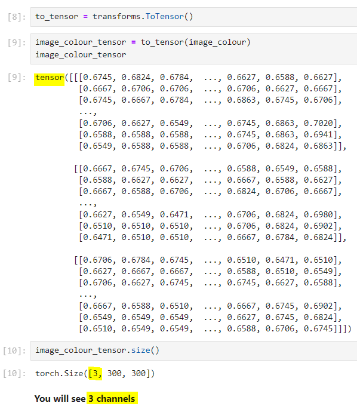
 
 

For a grayscale image, it will have only 1 channel as shown in Step 4b.

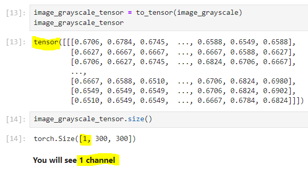
 
 

In Step 4c, I have shown another tensor form where the values are from 0 to 255 instead of from 0 to 1. Sometimes in files that store tensors of images, the values could be from 0 to 255 instead of from 0 to 1. Hence, this step is shown for awareness purpose. Image can be plotted out regardless of whether the values are from 0 to 255 or from 0 to 1. However, you may have to correct the shape of the tensor.

Use permute to reshape >>> 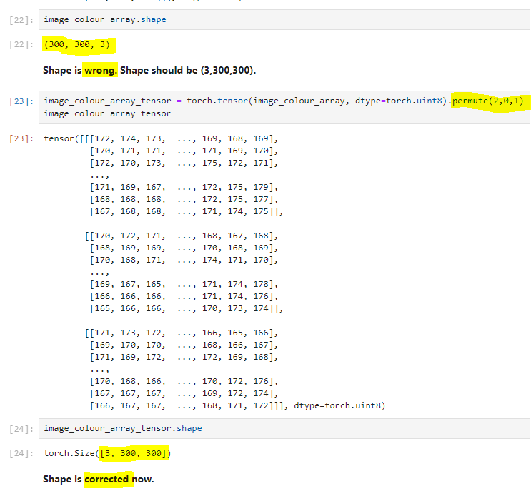
 
 

Use unsqueeze to reshape >>> 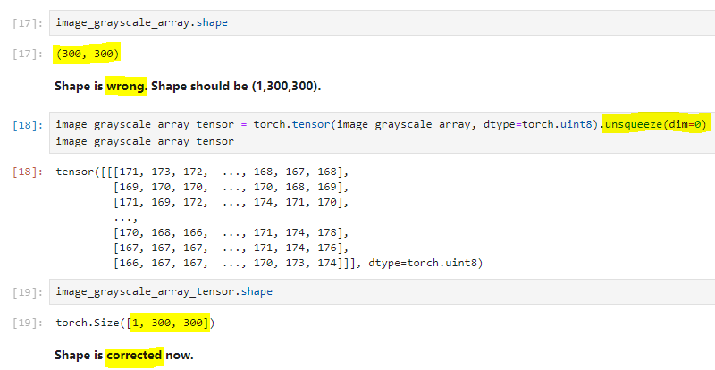
 
 

## <u>**Convolution and Rectified Linear Unit Function**</u>
 

The objective of Convolution is to pass a filter (also known as a kernel) through the image to pick up its features such as the edges, corners, and shapes. Its output is known as a feature map. There can be many filters to make many feature maps for each image, with each feature map picking up different features. You can refer to Step 5 and Step 6.
 
 

In order for the values at the 4 edges of the image to be used by the filter, padding is needed.
 
 

The objective of the Rectified Linear Unit (ReLU) function, after Convolution, is to reduce the gradation between the features and their surroundings. Firstly, this will further highlight the features. Secondaly, this will create non-linearity in the system so that more complex features can be picked up. You can refer to Step 7 and Step 8.
 
 

Features picked up in one feature map

After Convolution >>> 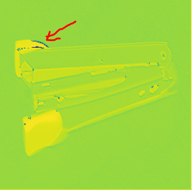 &nbsp;&nbsp;&nbsp; After ReLU >>> 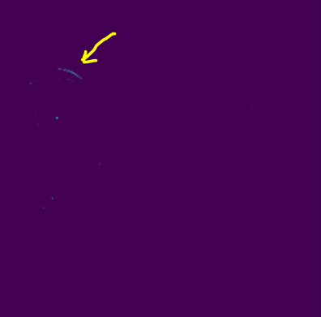
 
 

Features picked up in another feature map

After Convolution >>> 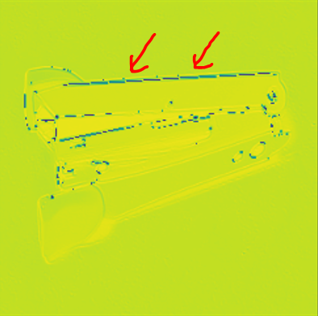 &nbsp;&nbsp;&nbsp; After ReLU >>> 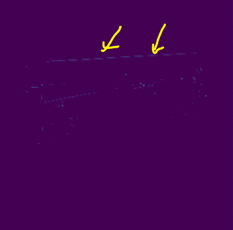
 
 

At this point, you may open ***step_02a*** and ***step_02b*** jupyter notebooks and MS Excel files to go through Convolution and ReLU by hand to internalise your learning.
 
 

When you see the values (also known as weights) inside the filter, do not be surprised that they are not "1" and "0" as shown in many online articles. I have consulted the PyTorch Community and this is their explanation to me >>> https://discuss.pytorch.org/t/why-are-weights-or-kernel-floats-and-not-integers-in-torch-nn-conv2d/194076
 
 

## <u>**Max Pooling**</u>
 

In Step 9 and Step 10, the objective of Max Pooling is to reduce the size of the feature map while retaining the features inside. This will reduce the computational load on the system. At the same time, the model can be made more generalisable.

Size reduced from (300,300) to (150,150) >>> 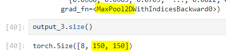
 
 

## <u>**Flattening**</u>
 

In Step 11, the objective of Flattening is to enable the output from Max Pooling to fit into the input of the Fully Connected Layer. All feature maps will collapsed into a 1-dimensional tensor.

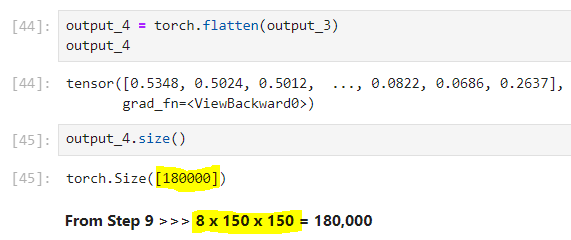
 
 

## <u>**Fully Connected Layer**</u>
 

Finally, in Step 12, the Fully Connected Layer is an Artificial Neural Network (ANN) with two layers. The first layer accepts inputs from Flattening. To produce the output to the second layer, Linear Transformation (sum of input multiplied by weights with an added Bias) will be done in the nodes before passing them through ReLU to become the output to the second layer.

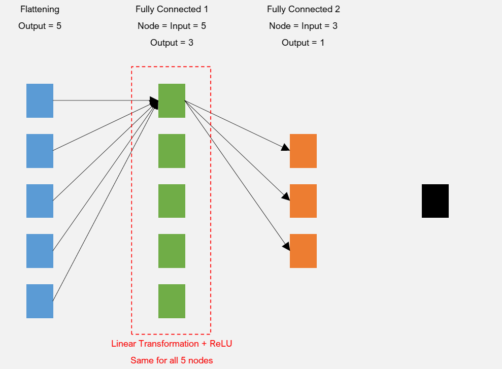 &nbsp;&nbsp;&nbsp; 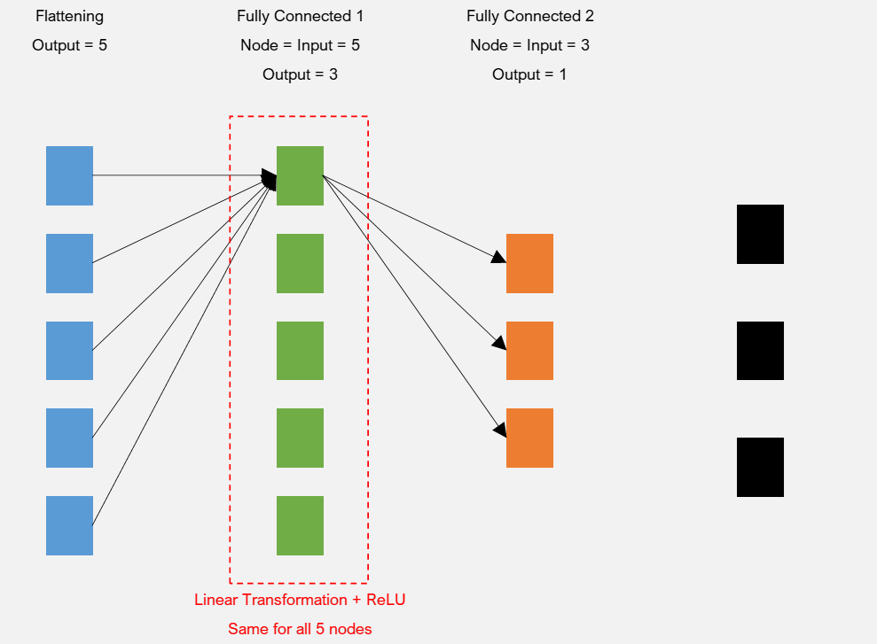
 
 

If the objective is to do a binary image classification (boat or not boat), Linear Transformation will be done, followed by Sigmoid as shown in Step 13a.

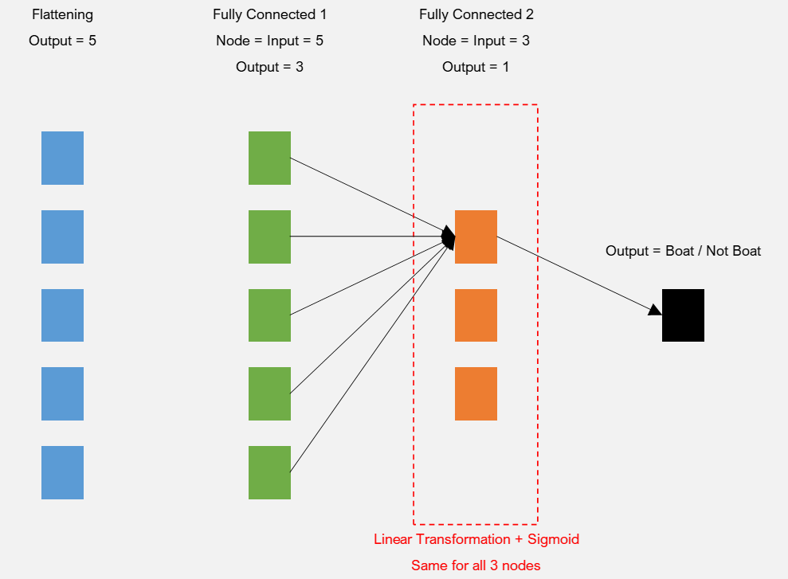
 
 

If the objective is to do a multiple image classification (boat, plane, or house), Linear Transformation will be done only as shown in Step 13b.

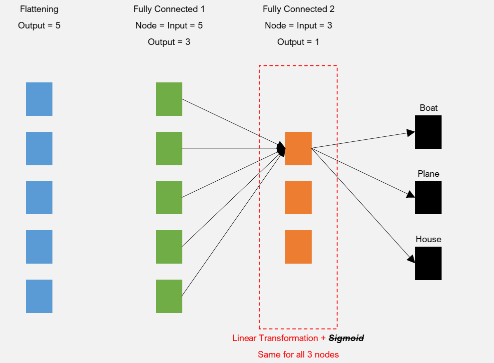
 
 

## <u>**Pickle File**</u>
 

You may open ***step_03a*** jupyter notebook to follow along.
 
 

The pickle file, in this case, is a dictionary (Step 3). However, it cannot be converted to a dataframe (Step 4) due to the following reasons:
* There is one key with a different length. This key needs to be removed.
* There is one key with a list of lists as the datatype. The list of this key has to be split into the individual lists.
 
 

Once done, the dictionary can be converted to a dataframe.
 
 

Recall that the tensor form of an image should be (1,X,X) or (3,X,X). The lists in the column of the dataframe above does not have this shape. Hence they have to be reshaped accordingly in Step 5. Then in Step 6, images can be displayed.
 
 

***step_03b*** jupyter notebook was used to combine 5 training datasets into 1. At the same time, it also reshape the tensor form of an image in the training and testing datasets.
 
 

That is, folks! As mentioned above, here are some references which you can read more about for the detailed explanations:
 
 

Activation Functions in Neural Networks [12 Types & Use Cases]  
https://www.v7labs.com/blog/neural-networks-activation-functions
 
 

Fully Connected Layer vs. Convolutional Layer: Explained  
https://builtin.com/machine-learning/fully-connected-layer
 
 

What is a neural network flatten layer?  
https://www.educative.io/answers/what-is-a-neural-network-flatten-layer
 
 

Max Pooling  
https://deepai.org/machine-learning-glossary-and-terms/max-pooling#:~:text=What%20is%20Max%20Pooling%3F,dimensions%20of%20an%20input%20volume.
 
 

Convolution  
https://developer.nvidia.com/discover/convolution
 
 

ImageMagick v6 Examples -- Color Basics and Channels  
https://legacy.imagemagick.org/Usage/color_basics/
 
 
 
 

Hope you find this work useful. Watch out for Part 2. Feel free to connect with me in LinkedIn. Have a good day!
 
 

3 Jan 2024
 
 

John Wong &nbsp;&nbsp; 
 
 

**[BACK TO MAIN PAGE ==>](https://github.com/johnwck/my_da_ds_work/tree/master)**
 
