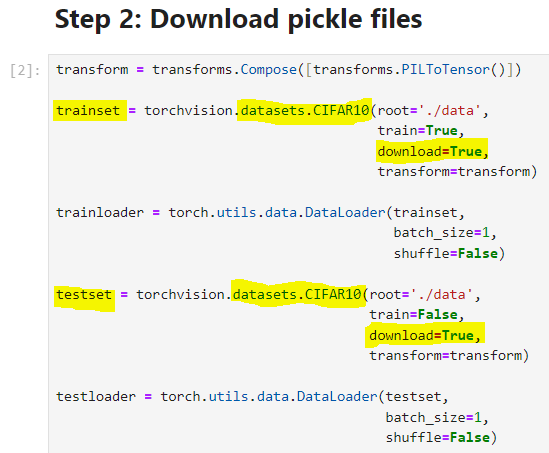
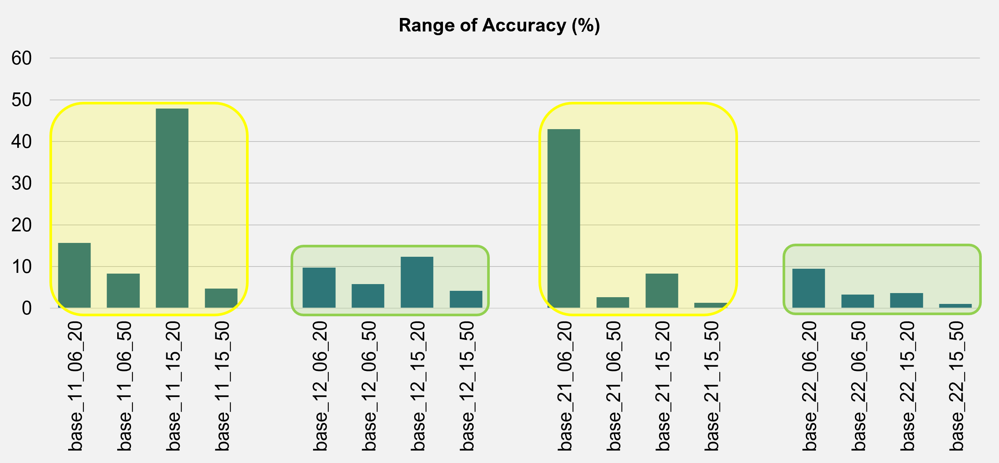

# **Convolutional Neural Network using PyTorch - Part 2 of 2**
 

## <u>**Context**</u>
 

From Part 1 of 2, you will have learned a high-level view of the followings in a Convolutional Neural Network (CNN):
* Convolution
* Rectified Linear Unit Function
* Max Pooling
* Flattening
* Fully Connected Layer
* Linear Transformation
* Colour and grayscale of image
* Channels of image
* Sizes of image
* Tensor forms of image
* Pickle file for images and their labels
 
 

In Part 2 of 2, I had initially wanted to dive straight into the classification of images by CNN using PyTorch. While training and testing my CNN models, however, I realised that there can be significant differences in their performance (classification accuracy). I shall elaborate on my discoveries below.
 
 

Meanwhile, the images are taken from the CIFAR-10 dataset. You can get the following information on it by visiting this URL >>> https://www.cs.toronto.edu/~kriz/cifar.html
* Number of data in training and testing datasets (50,000 and 10,000 respectively)
* Number of classes (10) and data per class (5,000 for training and 1,000 for testing)
* Type of classes (airplane, automobile, bird, cat, deer, dog, frog, horse, ship, truck)
* Size of images (3 x 32 x 32)
* Method of storage (in zipped pickle files by batches) and downloading
 
 

Another method of downloading the dataset is to execute Step 2 of jupyter notebook ***step_03a*** in Part 1 of 2:

 
 

This is because the datasets have been incorporated into "torchvision.datasets" of PyTorch.
 
 

## <u>**What others have done?**</u>
 

There are many online examples done on this dataset by CNN. Some use less complex model with the usual Conv2d, ReLU, and MaxPool2d. Others use more complex model with BatchNorm2d and Dropout. Image Augmentation (horizontal flip, vertical flip, and rotation) can also be used with less and more complex models.
 
 

Less complex

https://pytorch.org/tutorials/beginner/blitz/cifar10_tutorial.html
https://www.kaggle.com/code/shadabhussain/cifar-10-cnn-using-pytorch
 
 

More complex

https://github.com/NvsYashwanth/CIFAR-10-Image-Classification/blob/master/cifar10.ipynb
 
 

Image augmentation

https://debuggercafe.com/image-augmentation-using-pytorch-and-albumentations/
 
 

## <u>**Batch, Epoch, Feedforward, and Backpropagation**</u>
 

When training a CNN model, the training dataset is divided into batches. Each batch is fed into the model for these processes:
* Feedforward - Classifications
* Backpropagation - Adjustments of weights based on the specified cost function to make more accurate classifications
 
 

When all the batches are used once for training, an epoch is said to have completed. The whole process is repeated for a specified number of epochs.
 
 

At the end of each epoch, the total error will be recorded. This total error should reduce over the epochs. If the total error in the current epoch is not significantly different from the previous epoch, training can be stopped. The performance of the model can now be evaluated by using it to classify images on the testing dataset.
 
 

 
 

## <u>**My discoveries**</u>
 

For each base model, I have used the followings for training:
* Batch size of 128
* Epoch count of 50
* Seed value of 2, 3, 4, 5 and 6
* Shuffle value of NONE and 42 for dataset before separation into batches
 
 

Base model 1 (jupyter notebooks: ***step_01_base_11*** and ***step_02_base_11***):

| Design | Convolution | Input >>> Output | Fully Connected | Input >>> Output | Classification |
|---|---|---|---|---|---|
| 1 | Layer 1 | 3 >>> 6 | Layer 1 | 6 * 16 * 16 >>> 20 | 20 >>> 10 |
| 2 | Layer 1 | 3 >>> 6 | Layer 1 | 6 * 16 * 16 >>> 50 | 50 >>> 10 |
| 3 | Layer 1 | 3 >>> 15 | Layer 1 | 15 * 16 * 16 >>> 20 | 20 >>> 10 |
| 4 | Layer 1 | 3 >>> 15 | Layer 1 | 15 * 16 * 16 >>> 50 | 50 >>> 10 |

 
 

Base model 2 (jupyter notebooks: ***step_01_base_12*** and ***step_02_base_12***):

| Design | Convolution | Input >>> Output | Fully Connected | Input >>> Output | Classification |
|---|---|---|---|---|---|
| 1 | Layer 1 | 3 >>> 6 | Layer 1 Layer 2 | 6 * 16 * 16 >>> 20 20 >>> 40 | 40 >>> 10 |
| 2 | Layer 1 | 3 >>> 6 | Layer 1 Layer 2 | 6 * 16 * 16 >>> 50 50 >>> 100 | 100 >>> 10 |
| 3 | Layer 1 | 3 >>> 15 | Layer 1 Layer 2 | 15 * 16 * 16 >>> 20 20 >>> 40 | 40 >>> 10 |
| 4 | Layer 1 | 3 >>> 15 | Layer 1 Layer 2 | 15 * 16 * 16 >>> 50 50 >>> 100 | 100 >>> 10 |

 
 

Base model 3 (jupyter notebooks: ***step_01_base_21*** and ***step_02_base_21***):

| Design | Convolution | Input >>> Output | Fully Connected | Input >>> Output | Classification |
|---|---|---|---|---|---|
| 1 | Layer 1 Layer 2 | 3 >>> 6 6 >>> 12 | Layer 1 | 12 * 16 * 16 >>> 20 | 20 >>> 10 |
| 2 | Layer 1 Layer 2 | 3 >>> 6 6 >>> 12 | Layer 1 | 12 * 16 * 16 >>> 50 | 50 >>> 10 |
| 3 | Layer 1 Layer 2 | 3 >>> 15 15 >>> 30 | Layer 1 | 30 * 16 * 16 >>> 20 | 20 >>> 10 |
| 4 | Layer 1 Layer 2 | 3 >>> 15 15 >>> 30 | Layer 1 | 30 * 16 * 16 >>> 50 | 50 >>> 10 |

 
 

Base model 4 (jupyter notebooks: ***step_01_base_22*** and ***step_02_base_22***):

| Design | Convolution | Input >>> Output | Fully Connected | Input >>> Output | Classification |
|---|---|---|---|---|---|
| 1 | Layer 1 Layer 2 | 3 >>> 6 6 >>> 12 | Layer 1 Layer 2 | 12 * 16 * 16 >>> 20 20 >>> 40 | 40 >>> 10 |
| 2 | Layer 1 Layer 2 | 3 >>> 6 6 >>> 12 | Layer 1 Layer 2 | 12 * 16 * 16 >>> 50 50 >>> 100 | 100 >>> 10 |
| 3 | Layer 1 Layer 2 | 3 >>> 15 15 >>> 30 | Layer 1 Layer 2 | 30 * 16 * 16 >>> 20 20 >>> 40 | 40 >>> 10 |
| 4 | Layer 1 Layer 2 | 3 >>> 15 15 >>> 30 | Layer 1 Layer 2 | 30 * 16 * 16 >>> 50 50 >>> 100 | 100 >>> 10 |

 
 

<u>**First discovery**</u>

The range (maximum minus minimum) of classification accuracy between different seed values can be large and have high variability as shown below:

 
 
 
 

<u>**Second discovery**</u>

The range of classification accuracy combining shuffle_value=NONE and shuffle_value=42 can be large and have high variability as shown below:

 
 
 
 

<u>**Implication of discoveries**</u>

To have a good gauge of the performance of a CNN model in production, it is important to train it with different seed values and different shuffle values.
 
 

<u>**Question**</u>

There are so many seed values and shuffle values. With limited time, how do one find the final values to build a CNN model that can give the highest classification accuracy?
 
 

<u>**Possible answer**</u>

One can attempt to experiment using more Fully Connected Layers in the CNN model. The range of classification accuracy can be smaller and have lower variability compared to fewer Fully Connected Layers used as shown below.

 
 
 
 

## <u>**Saving, loading, and printing models**</u>

You may refer to jupyter notebooks ***step_03*** and ***step_04*** on how to save, load, and print (for confirmation) your CNN model.
 
 

That's it, folks! Hope you find this work useful. Feel free to connect with me in LinkedIn. Have a good day!
 
 
 
 

16 Jan 2024
 
 

John Wong &nbsp;&nbsp; 
 
 

**[BACK TO MAIN PAGE ==>](https://github.com/johnwck/my_da_ds_work/tree/master)**
 
