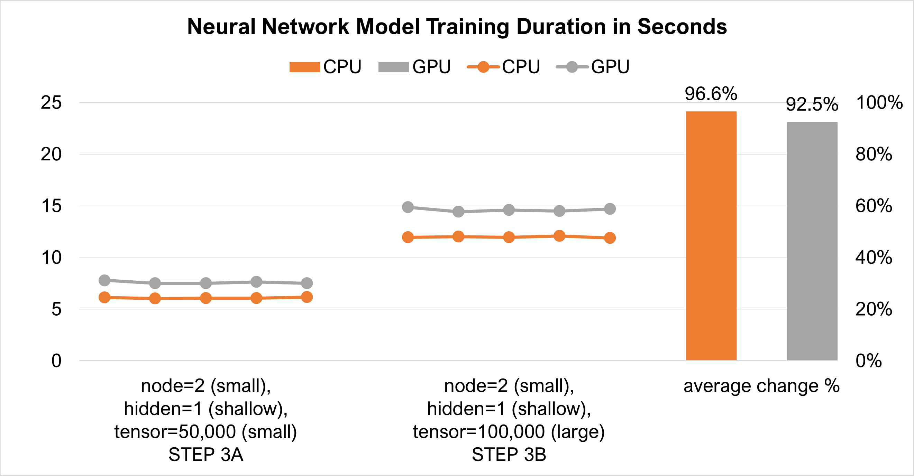

# **Exploration on Behaviour of Neural Network Model using PyTorch on Graphics Processing Unit**
 

## <u>**Context**</u>
 

When I was doing my Data Science Immersive course with General Assembly, we were taught to do Neural Network (NN) models using the TensorFlow library. I wanted to learn to use another library. So I picked PyTorch next.
 
 

In the course, we did the NN models on the Central Processing Unit (CPU). Since I have a laptop with a Nvidia Graphics Processing Unit (GPU), I decided to learn to do it on the GPU.
 
 

I am also interested to know if the GPU can train a NN model faster than the CPU.
 
 

Hence the focus of this work is on how to do NN model using PyTorch on the GPU and how it behaves on the GPU compared to the CPU.
 
 

## <u>**Installation of PyTorch**</u>
 

PyTorch can be installed from this Nvidia's website >>> https://pytorch.org/get-started/locally/
 
 

Select the appropriate options for you.
For me, I have selected these options:

 
 

In the box "Run this Command",
* Copy the command string.
* Open the Anaconda prompt.
* Paste the command string.
* Press ENTER to install PyTorch.
 

Things to note:
* From this Nvidia's website >>> https://docs.nvidia.com/deeplearning/cudnn/install-guide/index.html#install-windows, you will be taught to install (a) Nvidia graphic driver, (b) CUDA Toolkit, and (c) cuDNN.
* From this PyTorch's forum >>> https://discuss.pytorch.org/t/how-to-install-cudnn-for-pytorch-2-1-0-with-cuda-12-1/179864, you will learn that (b) and (c) will be installed together with PyTorch in the steps above. Hence you do not need to follow the instructions from the Nvidia's website to install them.
* However, (a) must be installed first. You can refer to this Nvidia's website >>> https://nvidia.custhelp.com/app/answers/detail/a_id/5021/kw/check%20graphic%20driver%20installation. This step may not be necessary as it should have been done on the laptop you purchased.
 

## <u>**Check Installation of PyTorch**</u>
 

You can use these Python codes to check that PyTorch has been installed correctly:

 
 

The Python codes above are also given in ***check_gpu.ipynb***.
 
 

## <u>**The Basics**</u>
 

You should go through the following tutorials from this Nvidia's website >>> https://pytorch.org/tutorials/beginner/basics/intro.html:
* Quickstart.
* Tensors.
* Datasets and DataLoaders.
* Build Model.
 
 

## <u>**Tensor**</u>
 

You can now open ***dataframe_tensor.ipynb*** to learn how to convert a dataframe to a tensor.

 &nbsp;&nbsp;&nbsp;&nbsp;&nbsp; 
 
 

## <u>**Pushing Tensor and Model to GPU**</u>
 

You can push the tensor and NN model to the GPU for training as follows:

[] &nbsp;&nbsp;&nbsp;&nbsp;&nbsp; []]
 
 

## <u>**GPU Versus CPU**</u>
 

Question: Will the training of a NN model on the GPU be faster than on the CPU?
 
 

The computational load placed on the CPU or GPU can be affected by the followings:
* Size of tensor.
* Number of nodes (tensor operations).
* Number of hidden layers (tensor operations).
* Size of Random Access Memory (RAM) of CPU (32 Gb in my case) and GPU (6 Gb in my case).
 
 

For the comparative study, the followings were done as experimental controls:
* Random seeds for random numbers and PyTorch algorithms were fixed.
* Epoch count and batch size were fixed.
* Learning rate, optimizer (method to minimise error amount), and loss function (function to calculate the error amount) were fixed.
* Power supply to laptop was switched on.
* Before every run of the Python codes in the jupyter notebook, the kernel was re-started and the outputs were cleared.
* While running the Python codes, no other programmes were accessed.
 
 

Answer: Here are the answers to the question above:

 
 

These were the behaviours observed:
* For larger tensor size alone and deeper model alone, the difference in training duration change between CPU and GPU are not significantly different.
 &nbsp;&nbsp;&nbsp;&nbsp;&nbsp; 
 
 

* However, the difference in training duration change is significant for larger node size interacting with deeper model.
 &nbsp;&nbsp;&nbsp;&nbsp;&nbsp; 
 
 

## <u>**Conclusion**</u>
 

In conclusion, if a NN model is deep and has many nodes at each hidden layer, it can be trained faster on the GPU compared to on the CPU.
 
 
 
 

That is, folks! Do visit the references below to learn more from the others:
 

Develop Your First Neural Network with PyTorch, Step by Step:  
https://machinelearningmastery.com/develop-your-first-neural-network-with-pytorch-step-by-step/
 
 

How to Choose an Activation Function for Deep Learning:  
https://machinelearningmastery.com/choose-an-activation-function-for-deep-learning/
 
 

Using neural nets to recognize handwritten digits:  
http://neuralnetworksanddeeplearning.com/chap1.html
Here, you will learn why a hidden layer is coded as follows:

 
 

TRAINING WITH PYTORCH:  
https://pytorch.org/tutorials/beginner/introyt/trainingyt.html
 

Here, you will learn about the training loop:

 
 
 
 
Hope you find this work useful. Feel free to connect with me in LinkedIn. Have a good day!

18 Dec 2023

John Wong &nbsp;&nbsp; 
 

**[BACK TO MAIN PAGE ==>](https://github.com/johnwck/my_da_ds_work/tree/master)**
 
